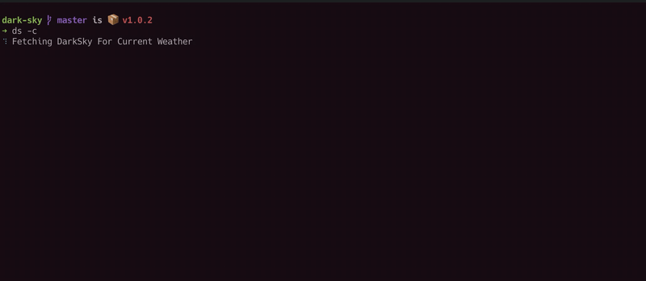

	<h1 align="center">Dark Sky CLI App</h1>

    A simple CLI App to fetch weather data from DarkSky in a way you can easily read

    

	
	
	
	
	
	

## Features
- You can get `current`, `today` and `weekly` weather data
- You can easily `add`, `delete` and `switch` to any location
- Colorized output for UV, Temperature, Pressure and Precipation types
- Pressure levels compare previous levels and shows changes

## How To Install:
### Using NPM
`npm i -g dark-sky-app`

### Download
- Download the [latest release](https://github.com/excalith/dark-sky/releases/latest)
- Within the directory, from your terminal
  - `npm install`
  - `npm link` (might ask for permission depending on your OS)

## How To Use:
You can run the app with `ds` command.

In order to start using app, you need a free DarkSky API token. You can get one from [DarkSky API](https://darksky.net/dev) page for free for 1000 api calls a day.

## Available Commands:

| _Command_        | _Description_          |
| ---------------- | ---------------------- |
| ds -a --add      | Adds a new location    |
| ds -g --get      | Gets a saved location  |
| ds -d --delete   | Deletes a location     |
| ds -c --current  | Shows current weather  |
| ds -t --today    | Shows todays weather   |
| ds -w --week     | Shows weekly weather   |
| ds -s --settings | Shows settings as JSON |
| ds -h --help     | Shows help             |

## How To Contribute
Please feel free to contribute!
* [Create issues](https://github.com/excalith/dark-sky/issues) for both issues and feature requests
* Create pull requests to **develop** for anything listed in issues
  * Please use prefixes such as Add, Fix, Update etc. before your commit message
  * Please be brief about your commit message